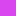
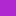

  <h1>💎 Crimson Style Guide</h1>
  
A comprehensive guide on how to properly <strong>use</strong> the Crimson palette

  
<em>A modern, sleek theme featuring deep obsidian backgrounds with warm undertones</em>

---

## Overview

Crimson is a modern, sleek color theme designed for optimal readability and visual comfort. It features a deep obsidian background (#0e0c0d) with subtle warm undertones for the dark theme and clean whites for the light theme, paired with vibrant crimson accents and carefully selected complementary colors following color theory principles.

The theme comes in two variants:
- **Crimson Dark** — Off-black backgrounds with vibrant, readable colors
- **Crimson Light** — Clean whites with rich, contrasting colors

---

## Color Palette

### Base Colors (Dark)

| Name | Hex | Preview | Usage |
|------|-----|---------|-------|
| **Obsidian** | `#0e0c0d` |  | Main background, panels, status bar |
| **Midnight** | `#16131a` |  | Editor background, surfaces |
| **Dark Mauve** | `#1e1a1c` |  | Elevated surfaces, active tabs |
| **Warm Graphite** | `#2a2426` |  | Hover states, borders |
| **Charcoal Plum** | `#322a2e` |  | Active elements |
| **Dark Taupe** | `#3a3034` |  | Selected elements |

### Base Colors (Light)

| Name | Hex | Preview | Usage |
|------|-----|---------|-------|
| **Snow** | `#fafafa` |  | Main background, panels |
| **Ivory** | `#f5f5f5` |  | Editor background, surfaces |
| **Pearl** | `#f0f0f0` |  | Elevated surfaces, active tabs |
| **Silk** | `#e8e8e8` |  | Hover states, borders |
| **Cloud** | `#e0e0e0` |  | Active elements |
| **Mist** | `#d8d8d8` |  | Selected elements |

### Primary Colors

| Name | Hex | Preview | Usage |
|------|-----|---------|-------|
| **Crimson** | `#dc143c` |  | Primary accent (dark), keywords, errors |
| **Ruby** | `#c81e38` |  | Primary accent (light), keywords, errors |
| **Coral Red** | `#ff4466` |  | Bright accent, highlights |
| **Salmon** | `#ff6688` |  | Links, constructors |
| **Peach** | `#ff8866` |  | Numbers, constants |
| **Blush** | `#ffaacc` |  | Parameters (dark) |

### Secondary Colors

| Name | Hex | Preview | Usage |
|------|-----|---------|-------|
| **Emerald** | `#50c878` |  | Strings (dark), success |
| **Jade** | `#2d9d5f` |  | Strings (light), success |
| **Sky** | `#5b9bd5` |  | Functions (dark), info |
| **Azure** | `#2a6fad` |  | Functions (light), info |
| **Cyan** | `#22d3ee` |  | Enums, labels, escape sequences (dark) |
| **Teal** | `#0d9fb8` |  | Enums, labels, escape sequences (light) |
| **Gold** | `#ffd700` |  | Types, attributes, warnings (dark) |
| **Amber** | `#c89700` |  | Types, attributes, warnings (light) |
| **Magenta** | `#d946ef` |  | Preprocessor (dark) |
| **Purple** | `#b028d0` |  | Preprocessor (light) |
| **Orange** | `#ff8800` |  | Player 8 (dark) |
| **Tangerine** | `#d97000` |  | Numbers, constants (light) |

### Text Colors (Dark)

| Name | Hex | Preview | Usage |
|------|-----|---------|-------|
| **White** | `#e8e8e8` |  | Primary text, foreground |
| **Silver** | `#a0a0a0` |  | Muted text |
| **Gray** | `#6a6a6a` |  | Comments, placeholder text |
| **Dim** | `#4a4a4a` |  | Disabled text |

### Text Colors (Light)

| Name | Hex | Preview | Usage |
|------|-----|---------|-------|
| **Black** | `#1a1a1a` |  | Primary text, foreground |
| **Charcoal** | `#5a5a5a` |  | Muted text |
| **Slate** | `#8a8a8a` |  | Comments, placeholder text |
| **Light Gray** | `#b0b0b0` |  | Disabled text |

---

## General Usage

> **Note:** Text colors are guidelines. Always prioritize readability and maintain sufficient contrast ratios.

### Background Colors

| Function | Dark | Light |
|----------|------|-------|
| Main Background | Obsidian `#0e0c0d` | Snow `#fafafa` |
| Editor Background | Midnight `#16131a` | Ivory `#f5f5f5` |
| Panels & Sidebars | Obsidian `#0e0c0d` | Snow `#fafafa` |
| Elevated Surfaces | Dark Mauve `#1e1a1c` | Pearl `#f0f0f0` |
| Active Tab | Dark Mauve `#1a1618` | Pearl `#f0f0f0` |
| Inactive Tab | Obsidian `#0e0c0d` | Snow `#fafafa` |
| Hover State | Warm Graphite `#2a2426` | Silk `#e8e8e8` |
| Active State | Charcoal Plum `#322a2e` | Cloud `#e0e0e0` |
| Selected State | Dark Taupe `#3a3034` | Mist `#d8d8d8` |
| Active Line | `#1e1820` | `#ebebeb` |

### Typography

| Function | Dark | Light |
|----------|------|-------|
| Body Text | White `#e8e8e8` | Black `#1a1a1a` |
| Headlines | White `#e8e8e8` | Black `#1a1a1a` |
| Muted Labels | Silver `#a0a0a0` | Charcoal `#5a5a5a` |
| Placeholder | Gray `#6a6a6a` | Slate `#8a8a8a` |
| Disabled | Dim `#4a4a4a` | Light Gray `#b0b0b0` |
| Accent Text | Coral Red `#ff4466` | Ruby `#c81e38` |

### Interactive Elements

| Function | Dark | Light |
|----------|------|-------|
| Primary Accent | Crimson `#dc143c` | Ruby `#c81e38` |
| Cursor | Crimson `#dc143c` | Ruby `#c81e38` |
| Selection | Crimson @ 40% `#dc143c40` | Ruby @ 40% `#c81e3840` |
| Focused Border | Crimson `#dc143c` | Ruby `#c81e38` |
| Link Hover | Salmon `#ff6688` | Bright Ruby `#e02850` |

### Status Colors

| Status | Dark | Light |
|--------|------|-------|
| Error | Crimson `#dc143c` | Ruby `#c81e38` |
| Warning | Gold `#ffd700` | Amber `#c89700` |
| Success | Emerald `#50c878` | Jade `#2d9d5f` |
| Info | Sky `#5b9bd5` | Azure `#2a6fad` |
| Modified | Gold `#ffd700` | Amber `#c89700` |
| Created | Emerald `#50c878` | Jade `#2d9d5f` |
| Deleted | Crimson `#dc143c` | Ruby `#c81e38` |
| Renamed | Cyan `#22d3ee` | Teal `#0d9fb8` |

---

## Code Editor Syntax

### Language Defaults

| Syntax Element | Dark Color | Light Color |
|----------------|------------|-------------|
| **Keywords** | Coral Red `#ff4466` | Ruby `#c81e38` |
| **Strings** | Emerald `#50c878` | Jade `#2d9d5f` |
| **String Escape** | Cyan `#22d3ee` | Teal `#0d9fb8` |
| **String Special** | Mint `#6fdc94` | Sea Green `#3cb371` |
| **Numbers** | Peach `#ff8866` | Tangerine `#d97000` |
| **Booleans** | Peach `#ff8866` | Tangerine `#d97000` |
| **Constants** | Peach `#ff8866` | Tangerine `#d97000` |
| **Functions** | Sky `#5b9bd5` | Azure `#2a6fad` |
| **Methods** | Sky `#5b9bd5` | Azure `#2a6fad` |
| **Parameters** | Blush `#ffaacc` *(italic)* | Mauve `#d46088` *(italic)* |
| **Properties** | Light Sky `#a8d5ff` | Ocean `#3584c7` |
| **Types** | Gold `#ffd700` | Amber `#c89700` |
| **Type Super** | Bright Gold `#ffdd33` | Light Amber `#e0ab00` |
| **Interfaces** | Gold `#ffd700` | Amber `#c89700` |
| **Enums** | Cyan `#22d3ee` | Teal `#0d9fb8` |
| **Enum Variants** | Cyan `#22d3ee` | Teal `#0d9fb8` |
| **Constructors** | Salmon `#ff6688` | Ruby `#c81e38` |
| **Tags (HTML/XML)** | Coral Red `#ff4466` | Ruby `#c81e38` |
| **Attributes** | Gold `#ffd700` | Amber `#c89700` |
| **Comments** | Gray `#6a6a6a` *(italic)* | Slate `#8a8a8a` *(italic)* |
| **Doc Comments** | Light Gray `#8a8a8a` *(italic)* | Dark Slate `#6a6a6a` *(italic)* |
| **Operators** | Coral Red `#ff4466` | Ruby `#c81e38` |
| **Punctuation** | Silver `#b0b0b0` | Charcoal Gray `#4a4a4a` |
| **List Markers** | Coral Red `#ff4466` | Ruby `#c81e38` |
| **Special Punctuation** | Salmon `#ff6688` | Bright Ruby `#e02850` |
| **Regex** | Peach `#ff8866` | Tangerine `#d97000` |
| **Preprocessor** | Magenta `#d946ef` | Purple `#b028d0` |
| **Labels** | Cyan `#22d3ee` | Teal `#0d9fb8` |
| **Variables** | White `#e8e8e8` | Black `#1a1a1a` |
| **Special Variables** | Salmon `#ff6688` | Bright Ruby `#e02850` |
| **Titles** | Salmon `#ff6688` *(bold)* | Ruby `#c81e38` *(bold)* |
| **Links** | Sky `#5b9bd5` *(underline)* | Azure `#2a6fad` *(underline)* |
| **Link URIs** | Cyan `#22d3ee` | Teal `#0d9fb8` |

### Editor UI

| Element | Dark | Light |
|---------|------|-------|
| Line Numbers | Dusty Plum `#524850` | Silver `#a0a0a0` |
| Active Line Number | Crimson `#dc143c` | Ruby `#c81e38` |
| Cursor Line BG | `#2a2a2a` | `#ebebeb` |
| Selection BG | Crimson @ 40% `#dc143c40` | Ruby @ 40% `#c81e3840` |
| Search Match BG | Crimson @ 40% `#dc143c40` | Ruby @ 40% `#c81e3840` |
| Indent Guide | Warm Graphite `#2a2428` | Silk `#e8e8e8` |
| Active Indent Guide | Dusty Plum `#524850` | Silver `#a0a0a0` |
| Wrap Guide | Warm Graphite `#2a2428` | Silk `#e8e8e8` |
| Invisible Characters | Dim `#4a4a4a` | Light Gray `#b0b0b0` |

---

## Terminal Colors

These ANSI colors are designed to work well on both dark and light backgrounds. Use the unified palette for consistent appearance across all terminal applications.

| Color | Normal | Bright | Dim |
|-------|--------|--------|-----|
| **Black** | `#1a1a1a` | `#5a5a5a` | `#0a0a0a` |
| **Red** | `#dc143c` | `#ff4466` | `#a01828` |
| **Green** | `#50c878` | `#6fdc94` | `#2d9d5f` |
| **Yellow** | `#ffd700` | `#ffe84d` | `#c89700` |
| **Blue** | `#5b9bd5` | `#7db3e8` | `#2a6fad` |
| **Magenta** | `#d946ef` | `#e879f9` | `#b028d0` |
| **Cyan** | `#22d3ee` | `#4de1f5` | `#0d9fb8` |
| **White** | `#e8e8e8` | `#ffffff` | `#c8c8c8` |

---

## Diff & Git

Unified colors for version control indicators.

| Function | Color | Hex |
|----------|-------|-----|
| Added/Created | Emerald | `#50c878` |
| Modified | Gold | `#ffd700` |
| Deleted | Crimson | `#dc143c` |
| Renamed | Cyan | `#22d3ee` |
| Conflict | Orange | `#ff8800` |
| Ignored | Gray | `#6a6a6a` |

---

## Color Theory & Design Principles

### 1. **Deep Obsidian with Warm Undertones**
The dark theme uses `#0e0c0d` (Obsidian) for panels and `#16131a` (Midnight) for the editor—deep blacks with subtle warm purple-brown undertones. This creates a sophisticated, modern feel while reducing eye strain during extended use.

### 2. **Vibrant Yet Readable**
All accent colors are carefully tuned to be vibrant without being harsh. Each color maintains excellent contrast against both dark and light backgrounds while remaining easy on the eyes.

### 3. **Complementary Color Harmony**
The palette follows established color theory with crimson as the primary accent:
- **Green** (Emerald/Jade) — Complementary, used for strings and success
- **Blue** (Sky/Azure) — Cool contrast for functions and information
- **Yellow/Gold** — Warm accent for types and warnings
- **Cyan/Teal** — Vibrant accent for enums and special elements
- **Magenta/Purple** — Striking accent for preprocessor directives

### 4. **Semantic Consistency**
Colors maintain consistent meaning throughout all themed applications:
- **Red shades** → Keywords, errors, deletions, tags
- **Green shades** → Strings, success, additions
- **Blue shades** → Functions, methods, information
- **Gold/Yellow** → Types, constants, warnings
- **Cyan** → Enums, labels, escapes, renamed items

### 5. **Hierarchical Clarity**
Background colors create visual depth through progressive lightening (dark) or darkening (light). Text colors indicate importance levels from primary to disabled, and syntax colors clearly distinguish code elements.

### 6. **Accessibility**
All foreground/background combinations meet WCAG AA contrast requirements for normal text (4.5:1) and large text (3:1), ensuring readability for users with visual impairments.

### 7. **Unified Terminal & Git Colors**
A single set of ANSI and Git colors works across both light and dark themes, ensuring consistent experience when switching between variants or using terminal applications.

---

## Quick Reference

### Most Common Colors

**Dark Theme:**
- Keywords: `#ff4466` (Coral Red)
- Strings: `#50c878` (Emerald)
- Functions: `#5b9bd5` (Sky)
- Types: `#ffd700` (Gold)
- Comments: `#6a6a6a` (Gray)

**Light Theme:**
- Keywords: `#c81e38` (Ruby)
- Strings: `#2d9d5f` (Jade)
- Functions: `#2a6fad` (Azure)
- Types: `#c89700` (Amber)
- Comments: `#8a8a8a` (Slate)

---

## Acknowledgments

The Discord theme structure is inspired by [Catppuccin](https://github.com/catppuccin/discord), a beautiful pastel theme project.

---

  
<em>Crafted with 💎 for developers who demand both beauty and functionality.</em>

  
<strong>Version 4.0 — Unified Color Edition</strong>

